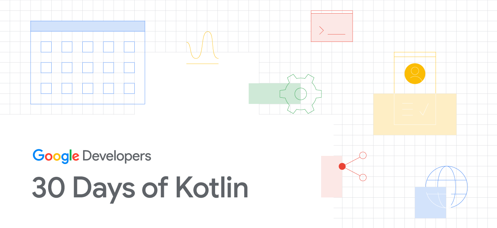

## Kotlin Bootcamp for Programmers
> Codelabs hands on kotlin session [Kotlin Bootcamp for Programmers](https://developer.android.com/courses/kotlin-bootcamp/overview)

### Lesson 1: 
> Get started: learn how to work with the Kotlin REPL (Read-Eval-Print Loop) [Codelabs](https://codelabs.developers.google.com/codelabs/kotlin-bootcamp-introduction/#0)